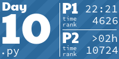

# Advent Of Code
Code written by me to solve AOC problems

Tiles below from https://github.com/LiquidFun/aoc_tiles

<!-- AOC TILES BEGIN -->
<h1 align="center">
  Advent of Code - 43/452 ⭐
</h1>
<h1 align="center">
  2024 - 2 ⭐ - Python
</h1>

<h1 align="center">
  2023 - 21 ⭐ - Python
</h1>

<h1 align="center">
  2022 - 20 ⭐ - Python
</h1>

<!-- AOC TILES END -->